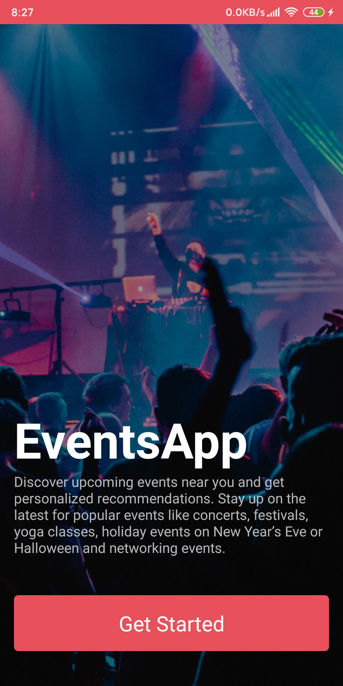
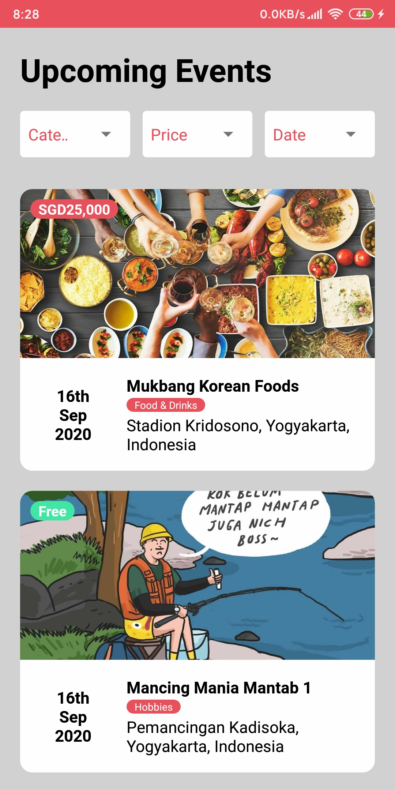
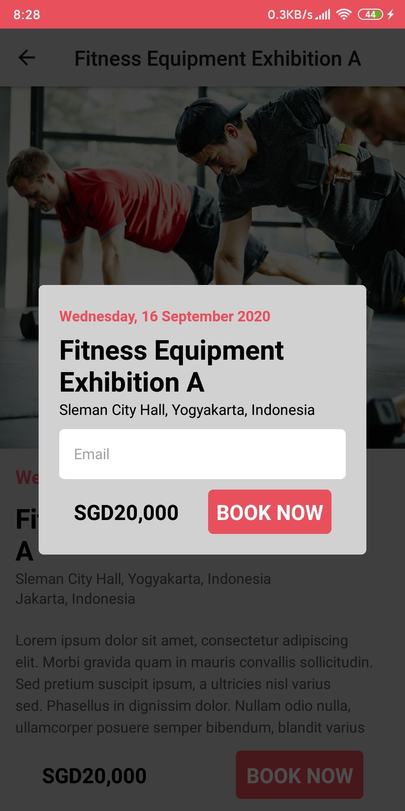

# EventsApp

## Description
The EventsApp is a platform for people to search and register for events, parties and concerts. Participate in the events you want, enter your email address and get invitations to the event in your email inbox.
## Features
* Searching and view events
* View events details
* Participate to the events with submitting your email
## How to run
* Clone this project.
* At root directory run `npm install` to install the dependencies.
##### Android
* Run `react-native run-android` to run on Android devices
##### iOS
* Run `cd ios/ && pod install`.
* Then run `react-native run-ios` to run the project on iOS devices or run through Xcode.

## Technology
* Regularly update the library to the latest version.
* Routing with React Navigation (BottomTabNavigator, StackNavigator).
* Apply flow with Redux pattern and Thunk for middleware.
* MomentJS,etc.

## Showcase
    